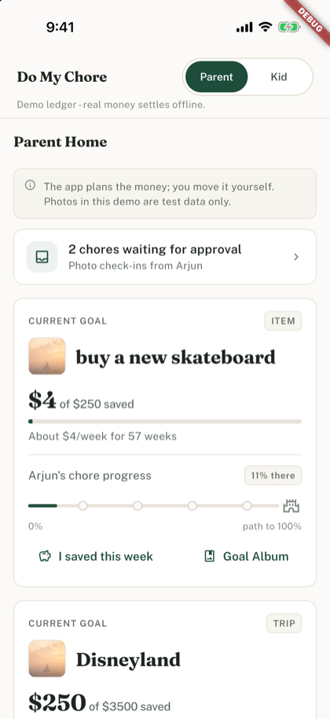

# Do My Chore

**Kid habits earn 100%. Parent plans the save.** A Flutter + Supabase POC built for [Build With AI: Basics](https://learn-ai-basics.devpost.com/).

Project site: https://pamu512.github.io/do-my-chore/

The kid earns the goal through weighted habit chores - a percent bar, never dollars. The parent plans the real cost with an AI-suggested save schedule. Two accountabilities, one goal.

Demo video (1:09): https://youtu.be/Ie_Vj2_QrQY

[](https://youtu.be/Ie_Vj2_QrQY)

## The demo loop

1. Parent creates a goal - family trip or kid item, real cost, target date (Disneyland, $3,500, ~14 weeks) → **Suggest plan** drafts the weekly parent save plus weighted chores summing to **at least 100%**, with a plain-language *why* → edit anything → accept
2. In-app **role switch** to Kid → Today list is **percent-only** (no dollars on any kid screen) → mark done, with photo check-in where looking works
3. Role switch back → **Approve**, or **Send back** with a note. The sheet previews exactly what the kid will read
4. Approvals move the kid's % bar (one small slice of the chore's weight per check-in); rejected chores return to Today as a **NEXT TRY** with the parent's note
5. Parent tracks the real save with **"I saved this week"**; if the kid falls behind pace, makeup chores are a parent choice - off by default, never automatic
6. Approved photos collect into a deletable **Goal Album**

## Architecture

- **Flutter** (iOS simulator primary) - Parent ↔ Kid role switch on one seeded demo family
- **Supabase** - Auth, Postgres with **RLS on every family-scoped table**, Storage (family-scoped paths) for photos, Edge Functions for AI
- **Progress is derived, not stored** - the kid's % comes from approved submissions × per-check-in credits (`weight / expected instances`); no denormalized balance
- **Both AI moments** (**Suggest plan**, **Photo assist**) run deterministically with **zero API keys**; set `OPENAI_API_KEY` to upgrade them. The AI suggests; the parent is always final. Optional Nebius Token Factory + Tavily secrets are documented in [`docs/nebius-token-factory.md`](docs/nebius-token-factory.md) and are **never required for Basics**.

## Run it

### 1. Supabase (local via Docker)

```bash
brew install supabase/tap/supabase   # once
supabase start                       # from repo root; starts Postgres/Auth/Storage/Functions
supabase db reset                    # applies migrations + demo seed
supabase status                      # note the API URL and anon key
```

### 2. Flutter app

```bash
cd app
flutter pub get
flutter run \
  --dart-define=SUPABASE_URL=http://127.0.0.1:54321 \
  --dart-define=SUPABASE_ANON_KEY=<anon key from supabase status>
```

### 3. Demo accounts

| Account | Password |
|---|---|
| `parent@demo` | `demo1234` |
| `kid@demo` | `demo1234` |

These are **demo-only credentials for a local instance**. Never reuse them anywhere real. The seeded family has one goal ("Disneyland") and a mix of chores with and without photo requirements.

## Live AI (hosted Nebius)

Suggest plan and photo assist call the hosted functions. With no key they stay on the deterministic plan and the photo-assist abstain. `NEBIUS_API_KEY` selects Nebius Token Factory. `OPENAI_API_KEY` is the fallback provider.

`DEMO_WALK=true` is a camera stub only. Suggest plan and photo assist still call live AI. The stub writes a bundled photo to the same temp path the camera would use: `app/assets/photos/dishes.jpg` for wash/dishes (and any other title), `laundry.jpg` for fold/laundry, `bed.jpg` for tidy/bed/room.

```bash
cd app
flutter run \
  --dart-define=SUPABASE_URL=https://mqwgmaiigynmmxpnejrf.supabase.co \
  --dart-define=SUPABASE_ANON_KEY=<anon key> \
  --dart-define=DEMO_WALK=true
```

Set the Token Factory key as a function secret (never in git), then deploy the three functions. Do not pass `--no-verify-jwt`.

```bash
supabase secrets set NEBIUS_API_KEY=... --project-ref mqwgmaiigynmmxpnejrf
supabase functions deploy suggest-plan --project-ref mqwgmaiigynmmxpnejrf
supabase functions deploy photo-assist --project-ref mqwgmaiigynmmxpnejrf
supabase functions deploy goal-cost-orchestrate --project-ref mqwgmaiigynmmxpnejrf
```

Text calls use NVIDIA Nemotron `nvidia/NVIDIA-Nemotron-3-Nano-30B-A3B` on Nebius Token Factory (`https://api.tokenfactory.nebius.com/v1/`). Photo checks use Nebius Token Factory with `Qwen/Qwen3.8-27B` (set via `NEBIUS_VISION_MODEL`; Token Factory has no Nemotron vision model on this account). Both ids are the defaults in `supabase/functions/_shared/llm.ts`.

Optional function secrets override those defaults: `NEBIUS_BASE_URL` (default `https://api.tokenfactory.nebius.com/v1/`), `NEBIUS_VISION_BASE_URL` (vision calls only; falls back to `NEBIUS_BASE_URL`), `NEBIUS_TEXT_MODEL`, and `NEBIUS_VISION_MODEL`.

`scripts/smoke_live_nebius.sh` signs in the demo parent and kid, then saves live responses (HTTP status and a UTC timestamp, tokens and emails removed) as proof:

- [`docs/evidence/2026-10-05-suggest-plan-live.json`](docs/evidence/2026-10-05-suggest-plan-live.json)
- [`docs/evidence/2026-10-05-photo-assist-live.json`](docs/evidence/2026-10-05-photo-assist-live.json)

## Honesty notices

- **Money:** the app plans and tracks; it is not a bank, card, or payment rail. Parents settle real money **offline**. Kid screens show percent only.
- **Photos & kids:** all photos and kid accounts in this demo are **test data only**. Check-in photos live in the family's scoped storage. This POC does not implement COPPA-style verifiable parental consent. That is a hard requirement before any real family use.
- **AI:** photo assist only *suggests*; **the parent is always final**. No verification-accuracy claims anywhere.

## Repository docs

- [`scope.md`](scope.md) · [`prd.md`](prd.md) · [`spec.md`](spec.md) - planning docs (rev 3)
- [`docs/superpowers/specs/2026-09-27-do-my-chore-money-model-rev3.md`](docs/superpowers/specs/2026-09-27-do-my-chore-money-model-rev3.md) - money model rev 3 (locked)
- [`docs/superpowers/specs/2026-09-29-encouragement-layer-v3.md`](docs/superpowers/specs/2026-09-29-encouragement-layer-v3.md) - V3 encouragement layer (locked)
- [`docs/demo-video-script.md`](docs/demo-video-script.md) - 1–3 min demo shot list
- [`docs/devpost-draft.md`](docs/devpost-draft.md) - submission draft

## Layout

```
app/          Flutter app (lib/features/{parent,kid,shell}, services, models)
supabase/     config.toml, migrations/, seed.sql, functions/{suggest-plan,photo-assist,goal-cost-orchestrate,_shared}
docs/         design spec, implementation plan, demo script
```

## License

MIT License. See [LICENSE](LICENSE).
